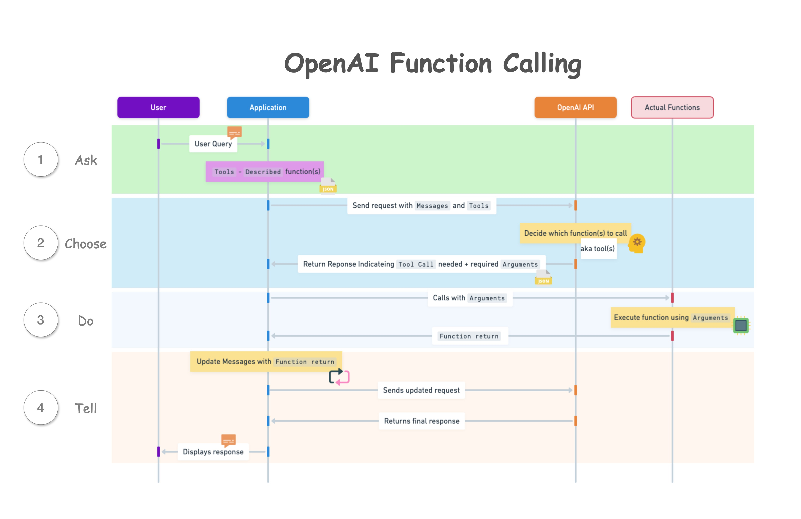
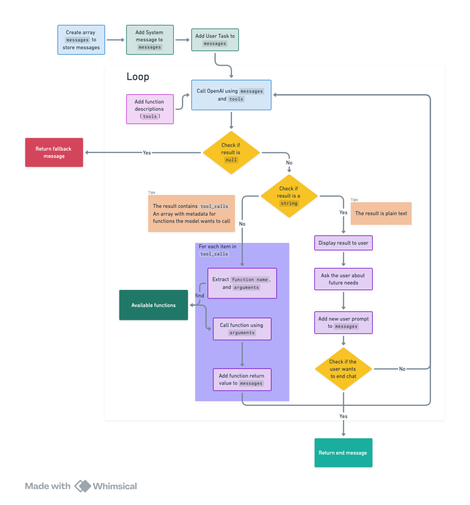
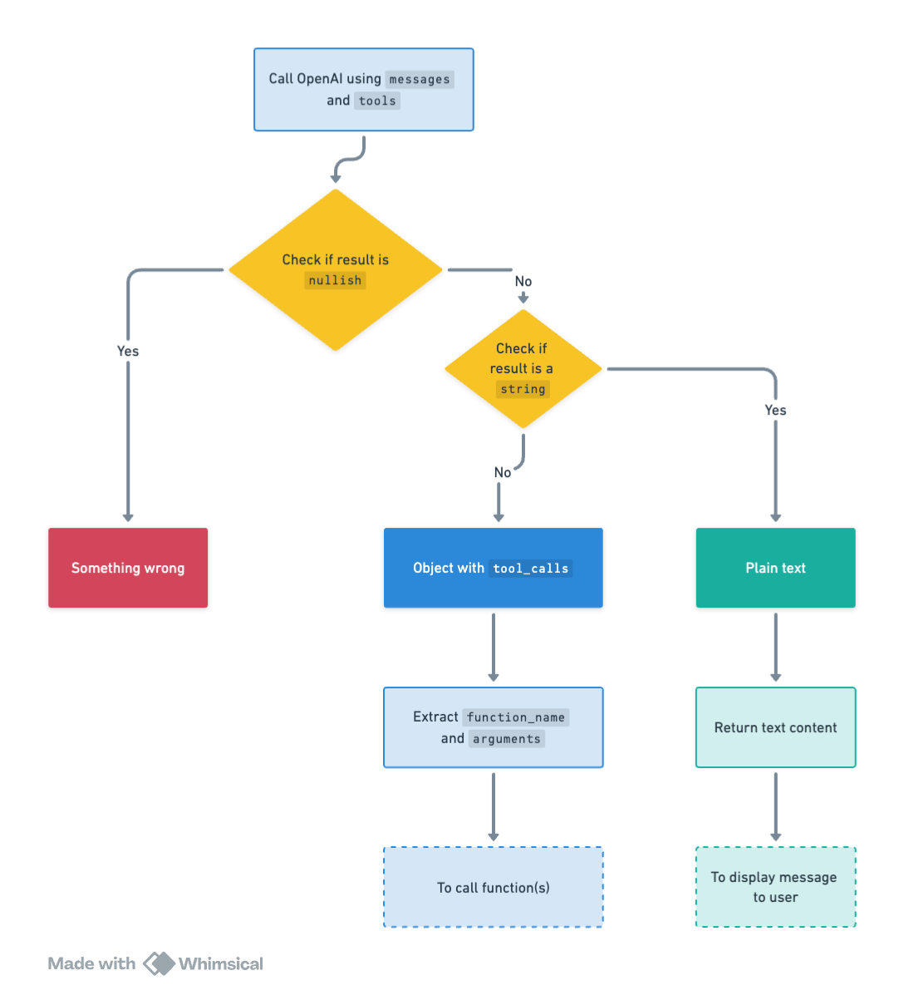

# Create an Agent with OpenAI Function Calling Capabilities

### OpenAI Function Calling in 2024

## Introduction

As we navigate through 2024, the rush to develop AI-powered applications is unmistakable, thanks to their clear benefits.

Traditionally, creating an app involves writing separate functions or services for each feature, like user login or booking a ticket. This process often requires users to fill out forms, ticking boxes and entering data, which must then pass through various validation checks to ensure that the data is usable. This method, especially when involving multiple steps, significantly detracts from the user experience.

Consider planning a one-day farm trip for Easter. You're undecided about the date but have specific requirements: the farm must be within a two-hour drive, offer certain activities, have cloudy weather (as your child is allergic to the sun), and you need to consult your partner before making a decision. The traditional approach would involve navigating through multiple pages, steps, and forms - a snapshot of the complexities in daily decision-making. This complexity is a key reason why, despite the prevalence of booking websites, many still prefer the personalized service of a travel agent for planning trips.

## What AI can do

AI introduces significant improvements by:

1. Providing a conversational experience, making interactions feel more natural and user-friendly.
2. Consolidating app features into a single entry point. Unlike traditional apps, where different pages and forms are needed for different functions, AI can interpret user inputs and seamlessly select and execute the necessary functions, even handling complex requests in a step-by-step manner.

However, a major challenge remains: dealing with the unstructured text data returned by AI models.

Traditionally, extracting structured data (like JSON) from model outputs required complex prompt engineering or regular expressions (RegEx), which can be error-prone and inconsistent due to the unpredictable nature of AI models and the variability of user inputs.

To address this, OpenAI has rolled out two innovative features: `Json mode` and `Function calling`. This article will delve into the Function calling feature, illustrating how it streamlines the extraction of structured data from model outputs, complemented by TypeScript code examples.

Discover all the code examples in this [Github repository](https://github.com/bianbianzhu/openai-function-calling) and consider giving it a star if you find it useful.

## Current challenges

- Structured Data Handling: Previously, developers relied on RegEx or intricate prompt engineering to parse text data, a process fraught with complexity and errors. Function Calling simplifies this by allowing models to process user-defined functions, generating structured outputs like JSON without the need for cumbersome techniques.

- Consistency and Predictability: Function Calling ensures consistent and predictable outcomes from AI models by enabling the definition of custom functions for precise information extraction. This guarantees structured and reliable outputs across varied inputs, essential for applications requiring dependable data extraction for text summarization, document analysis, and integrations with external APIs or databases.

## How it works

According to [OpenAI's documentation](https://platform.openai.com/docs/guides/function-calling), the basic sequence of steps for function calling is as follows:

1. Call the model with the user query and a set of functions defined in the functions(tools) parameter.
2. The model can choose to call one or more functions; if so, the content will be a stringified JSON object adhering to your custom schema (note: the model may hallucinate parameters).
3. Parse the string into JSON in your code, and call your function with the provided arguments if they exist.
4. Call the model again by appending the function response as a new message, and let the model summarize the results back to the user.



### Four key concepts that may be confusing at first:

1. **Tools**: The term `Functions` is depreciated and replaced by `Tools`. Currently, `Tools` exclusively support what is essentially the function type. Essentially, this change is in name and syntax

2. **Tools Description**: When we say you're passing "tools" to the model, think of it as providing a list or menu of what the model can do, not the actual functions. It's like telling the model, "Here are the actions you can choose to perform," without giving it the direct means to do so.

3. **Function Call Returns**: When the model suggests a function call, it's essentially saying, "I think we should use this tool and here's what we need for it," by naming the function and specifying any required information (`arguments`). However, at this point, it's just a suggestion; the actual action is carried out in your application.

4. **Using Responses to Inform the Next Steps**: Once a function is actually executed in your application and you have the results, you feed these results back to the model as part of a new prompt. This helps the model understand what happened and guides it in making the next move or response.

## Step-by-Step Guide to Building an Agent

### Business Case: Development of a Farm Trip Assistant Agent

We aim to develop a farm trip assistant agent designed to enhance the user experience in planning farm visits. This digital assistant will offer comprehensive support by:

- Identifying top farm destinations tailored to user location.
- Providing detailed information on available activities at each farm.
- Facilitating the booking of selected activities.
- Offering a straightforward process for filing complaints, if necessary.

### Application Architecture

This flowchart shows the architecture of the application:



### Pre-requisites

OpenAI API key: You can obtain this from the OpenAI platform.

### Step 1: Prepare to call the model

To initiate a conversation, begin with a system message and a user prompt for the task:

- Create a `messages` array to keep track of the conversation history.
- Include a system message in the `messages` array to to establish the assistant's role and context.
- Welcome the users with a greeting message and prompt them to specify their task.
- Add the user prompt to the `messages` array.

```typescript
const messages: ChatCompletionMessageParam[] = [];
console.log(StaticPromptMap.welcome);

messages.push(SystemPromptMap.context);

const userPrompt = await createUserMessage();
messages.push(userPrompt);
```

As my personal preference, all the prompts are stored in map objects for easy access and modification. Please refer to the following code snippets for all the prompts used in the application. Feel free to adopt or modify this approach as suits you.

- StaticPromptMap: Static messages that are used throughout the conversation.

```typescript
export const StaticPromptMap = {
  welcome:
    "Welcome to the farm assistant! What can I help you with today? You can ask me what I can do.",
  fallback: "I'm sorry, I don't understand.",
  end: "I hope I was able to help you. Goodbye!",
} as const;
```

- UserPromptMap: User messages that are generated based on user input.

```typescript
import { ChatCompletionUserMessageParam } from "openai/resources/index.mjs";

type UserPromptMapKey = "task";
type UserPromptMapValue = (
  userInput?: string
) => ChatCompletionUserMessageParam;

export const UserPromptMap: Record<UserPromptMapKey, UserPromptMapValue> = {
  task: (userInput) => ({
    role: "user",
    content: userInput || "What can you do?",
  }),
};
```

- SystemPromptMap: System messages that are generated based on system context.

```typescript
import { ChatCompletionSystemMessageParam } from "openai/resources/index.mjs";

type SystemPromptMapKey = "context";

export const SystemPromptMap: Record<
  SystemPromptMapKey,
  ChatCompletionSystemMessageParam
> = {
  context: {
    role: "system",
    content:
      "You are an farm visit assistant. You are upbeat and friendly. You introduce yourself when first saying `Howdy!`. If you decide to call a function, you should retrieve the required fields for the function from the user. Your answer should be as precise as possible. If you have not yet retrieve the required fields of the function completely, you do not answer the question and inform the user you do not have enough information.",
  },
};
```

- FunctionPromptMap: Function messages that are basically the return values of the functions.

```typescript
import { ChatCompletionToolMessageParam } from "openai/resources/index.mjs";

type FunctionPromptMapKey = "function_response";

type FunctionPromptMapValue = (
  args: Omit<ChatCompletionToolMessageParam, "role">
) => ChatCompletionToolMessageParam;

export const FunctionPromptMap: Record<
  FunctionPromptMapKey,
  FunctionPromptMapValue
> = {
  function_response: ({ tool_call_id, content }) => ({
    role: "tool",
    tool_call_id,
    content,
  }),
};
```

### Step 2: Define the tools

As mentioned earlier, `tools` are essentially the descriptions of functions that the model can call. In this case, we define four tools to meet the requirements of the farm trip assistant agent:

1. `get_farms`: Retrieves a list of farm destinations based on user's location.
2. `get_activities_per_farm`: Provides detailed information on activities available at a specific farm.
3. `book_activity`: Facilitates the booking of a selected activity.
4. `file_complaint`: Offers a straightforward process for filing complaints.

The following code snippet demonstrates how these tools are defined:

```typescript
import {
  ChatCompletionTool,
  FunctionDefinition,
} from "openai/resources/index.mjs";
import {
  ConvertTypeNameStringLiteralToType,
  JsonAcceptable,
} from "../utils/type-utils.js";

// An enum to define the names of the functions. This will be shared between the function descriptions and the actual functions
export enum DescribedFunctionName {
  FileComplaint = "file_complaint",
  getFarms = "get_farms",
  getActivitiesPerFarm = "get_activities_per_farm",
  bookActivity = "book_activity",
}

// This is a utility type to narrow down the `parameters` type in the `FunctionDefinition`.
// It pairs with the keyword `satisfies` to ensure that the properties of parameters are correctly defined.
// This is a workaround as the default type of `parameters` in `FunctionDefinition` is `type FunctionParameters = Record<string, unknown>` which is overly broad.
type FunctionParametersNarrowed<
  T extends Record<string, PropBase<JsonAcceptable>>
> = {
  type: JsonAcceptable; // basically all the types that JSON can accept
  properties: T;
  required: (keyof T)[];
};

// This is a base type for each property of the parameters
type PropBase<T extends JsonAcceptable = "string"> = {
  type: T;
  description: string;
};

// This utility type transforms parameter property string literals into usable types for function parameters.
// Example: { email: { type: "string" } } -> { email: string }
export type ConvertedFunctionParamProps<
  Props extends Record<string, PropBase<JsonAcceptable>>
> = {
  [K in keyof Props]: ConvertTypeNameStringLiteralToType<Props[K]["type"]>;
};

// Define the parameters for each function
export type FileComplaintProps = {
  name: PropBase;
  email: PropBase;
  text: PropBase;
};

export type GetFarmsProps = {
  location: PropBase;
};

export type GetActivitiesPerFarmProps = {
  farm_name: PropBase;
};

export type BookActivityProps = {
  farm_name: PropBase;
  activity_name: PropBase;
  datetime: PropBase;
  name: PropBase;
  email: PropBase;
  number_of_people: PropBase<"number">;
};

// Define the function descriptions
const functionDescriptionsMap: Record<
  DescribedFunctionName,
  FunctionDefinition
> = {
  [DescribedFunctionName.FileComplaint]: {
    name: DescribedFunctionName.FileComplaint,
    description: "File a complaint as a customer",
    parameters: {
      type: "object",
      properties: {
        name: {
          type: "string",
          description: "The name of the user, e.g. John Doe",
        },
        email: {
          type: "string",
          description: "The email address of the user, e.g. john@doe.com",
        },
        text: {
          type: "string",
          description: "Description of issue",
        },
      },
      required: ["name", "email", "text"],
    } satisfies FunctionParametersNarrowed<FileComplaintProps>,
  },
  [DescribedFunctionName.getFarms]: {
    name: DescribedFunctionName.getFarms,
    description: "Get the information of farms based on the location",
    parameters: {
      type: "object",
      properties: {
        location: {
          type: "string",
          description: "The location of the farm, e.g. Melbourne VIC",
        },
      },
      required: ["location"],
    } satisfies FunctionParametersNarrowed<GetFarmsProps>,
  },
  [DescribedFunctionName.getActivitiesPerFarm]: {
    name: DescribedFunctionName.getActivitiesPerFarm,
    description: "Get the activities available on a farm",
    parameters: {
      type: "object",
      properties: {
        farm_name: {
          type: "string",
          description: "The name of the farm, e.g. Collingwood Children's Farm",
        },
      },
      required: ["farm_name"],
    } satisfies FunctionParametersNarrowed<GetActivitiesPerFarmProps>,
  },
  [DescribedFunctionName.bookActivity]: {
    name: DescribedFunctionName.bookActivity,
    description: "Book an activity on a farm",
    parameters: {
      type: "object",
      properties: {
        farm_name: {
          type: "string",
          description: "The name of the farm, e.g. Collingwood Children's Farm",
        },
        activity_name: {
          type: "string",
          description: "The name of the activity, e.g. Goat Feeding",
        },
        datetime: {
          type: "string",
          description: "The date and time of the activity",
        },
        name: {
          type: "string",
          description: "The name of the user",
        },
        email: {
          type: "string",
          description: "The email address of the user",
        },
        number_of_people: {
          type: "number",
          description: "The number of people attending the activity",
        },
      },
      required: [
        "farm_name",
        "activity_name",
        "datetime",
        "name",
        "email",
        "number_of_people",
      ],
    } satisfies FunctionParametersNarrowed<BookActivityProps>,
  },
};

// Format the function descriptions into tools and export them
export const tools = Object.values(
  functionDescriptionsMap
).map<ChatCompletionTool>((description) => ({
  type: "function",
  function: description,
}));
```

#### Understanding Function Descriptions

Function descriptions require the following keys:

- `name`: Identifies the function.
- `description`: Provides a summary of what the function does.
- `parameters`: Defines the function's parameters, including their `type`, `description`, and whether they are `required`.
  - `type`: Specifies the parameter type, typically an object.
  - `properties`: Details each parameter, including its type and description.
  - `required`: Lists the parameters that are essential for the function to operate.

#### Adding a New Function

To introduce a new function, proceed as follows:

1. Extend DescribedFunctionName with a new enum, such as `DoNewThings`.
2. Define a Props type for the parameters, e.g., `DoNewThingsProps`.
3. Insert a new entry in the `functionDescriptionsMap` object.
4. Implement the new function in the function directory, naming it after the enum value.

### Step 3: Call the model with the messages and the tools

With the messages and tools set up, we're ready to call the model using them.

It's important to note that as of March 2024, function calling is supported only by the `gpt-3.5-turbo-0125` and `gpt-4-turbo-preview` models.

Code implementation:

```typescript
export const startChat = async (messages: ChatCompletionMessageParam[]) => {
  const response = await openai.chat.completions.create({
    model: "gpt-3.5-turbo",
    top_p: 0.95,
    temperature: 0.5,
    max_tokens: 1024,

    messages, // The messages array we created earlier
    tools, // The function descriptions we defined earlier
    tool_choice: "auto", // The model will decide whether to call a function and which function to call
  });

  const { message } = response.choices[0] ?? {};

  if (!message) {
    throw new Error("Error: No response from the API.");
  }

  messages.push(message);

  return processMessage(message);
};
```

#### `tool_choice` Options

The `tool_choice` option controls the model's approach to function calls:

- `Specific Function`: To specify a particular function, set `tool_choice` to an object with `type: "function"` and include the function's name and details. For instance, `tool_choice: { type: "function", function: { name: "get_farms"}}` tells the model to call the `get_farms` function regardless of the context. Even a simple user prompt like "Hi." will trigger this function call.

- `No Function`: To have the model generate a response without any function calls, use `tool_choice: "none"`. This option prompts the model to rely solely on the input messages for generating its response.

- `Automatic Selection`: The default setting, `tool_choice: "auto"`, lets the model autonomously decide if and which function to call, based on the conversation's context. This flexibility is beneficial for dynamic decision-making regarding function calls.

### Step 4: Handling Model Responses

The model's responses fall into two primary categories, with a potential for errors that necessitate a fallback message:



1. **Function Call Request**: The model indicates a desire to call function(s). This is the true potential of function calling. The model intelligently selects which function(s) to execute based on context and user queries. For instance, if the user asks for farm recommendations, the model may suggest calling the `get_farms` function.

But it doesn't just stop there, the model also analyzes the user input to determine if it contains the necessary information (`arguments`) for the function call. If not, the model would prompt the user for the missing details.

Once it has gathered all required information (`arguments`), the model returns a JSON object detailing the function name and arguments. This structured response can be effortlessly translated into a JavaScript object within our application, enabling us to invoke the specified function seamlessly, thereby ensuring a fluid user experience.

Additionally, the model can choose to call multiple functions, either simultaneously or in sequence, each requiring specific details. Managing this within the application is crucial for smooth operation.

Example of model's response:

```JSON
{
  "role": "assistant",
  "content": null,
  "tool_calls": [
    {
      "id": "call_JWoPQYmdxNXdNu1wQ1iDqz2z",
      "type": "function",
      "function": {
        "name": "get_farms", // The function name to be called
        "arguments": "{\"location\":\"Melbourne\"}" // The arguments required for the function
      }
    }
    ... // multiple function calls can be present
  ]
}
```

2. **Plain Text Response**: The model provides a direct text response. This is the standard output we're accustomed to from AI models, offering straightforward answers to user queries. Simply returning the text content suffices for these responses.

Example of model's response:

```JSON
{
  "role": "assistant",
  "content": {
    "text": "I can help you with that. What is your location?"
  }
}
```

The key distinction is the presence of a `tool_calls` key for `function calls`. If `tool_calls` is present, the model is requesting to execute a function; otherwise, it delivers a straightforward text response.

To process these responses, consider the following approach based on the response type:

```typescript
type ChatCompletionMessageWithToolCalls = RequiredAll<
  Omit<ChatCompletionMessage, "function_call">
>;

// If the message contains tool_calls, it extracts the function arguments. Otherwise, it returns the content of the message.
export function processMessage(message: ChatCompletionMessage) {
  if (isMessageHasToolCalls(message)) {
    return extractFunctionArguments(message);
  } else {
    return message.content;
  }
}

// Check if the message has `tool calls`
function isMessageHasToolCalls(
  message: ChatCompletionMessage
): message is ChatCompletionMessageWithToolCalls {
  return isDefined(message.tool_calls) && message.tool_calls.length !== 0;
}

// Extract function name and arguments from the message
function extractFunctionArguments(message: ChatCompletionMessageWithToolCalls) {
  return message.tool_calls.map((toolCall) => {
    if (!isDefined(toolCall.function)) {
      throw new Error("No function found in the tool call");
    }

    try {
      return {
        tool_call_id: toolCall.id,
        function_name: toolCall.function.name,
        arguments: JSON.parse(toolCall.function.arguments),
      };
    } catch (error) {
      throw new Error("Invalid JSON in function arguments");
    }
  });
}
```

The `arguments` extracted from the function calls are then used to execute the actual functions in the application, while the text content helps to carry on the conversation.

Below is an if-else block illustrating how this process unfolds:

```typescript
const result = await startChat(messages);

if (!result) {
  // Fallback message if response is empty (e.g., network error)
  return console.log(StaticPromptMap.fallback);
} else if (isNonEmptyString(result)) {
  // If the response is a string, log it and prompt the user for the next message
  console.log(`Assistant: ${result}`);
  const userPrompt = await createUserMessage();
  messages.push(userPrompt);
} else {
  // If the response contains function calls, execute the functions and call the model again with the updated messages
  for (const item of result) {
    const { tool_call_id, function_name, arguments: function_arguments } = item;

    // Execute the function and get the function return
    const function_return = await functionMap[
      function_name as keyof typeof functionMap
    ](function_arguments);

    // Add the function output back to the messages with a role of "tool", the id of the tool call, and the function return as the content
    messages.push(
      FunctionPromptMap.function_response({
        tool_call_id,
        content: function_return,
      })
    );
  }
}
```

### Step 5: Execute the function and call the model again

When the model requests a function call, we execute that function in our application and then update the model with the new messages. This keeps the model informed about the function's result, allowing it to give a pertinent reply to the user.

Maintaining the correct sequence of function executions is crucial, especially when the model chooses to execute multiple functions in a sequence to complete a task. Using a `for` loop instead of `Promise.all` preserves the execution order, essential for a successful workflow. However, if the functions are independent and can be executed in parallel, consider custom optimizations to enhance performance.

Here's how to execute the function:

```typescript
for (const item of result) {
  const { tool_call_id, function_name, arguments: function_arguments } = item;

  console.log(
    `Calling function "${function_name}" with ${JSON.stringify(
      function_arguments
    )}`
  );

  // Available functions are stored in a map for easy access
  const function_return = await functionMap[
    function_name as keyof typeof functionMap
  ](function_arguments);
}
```

And here's how to update the messages array with the function response:

```typescript
for (const item of result) {
  const { tool_call_id, function_name, arguments: function_arguments } = item;

  console.log(
    `Calling function "${function_name}" with ${JSON.stringify(
      function_arguments
    )}`
  );

  const function_return = await functionMap[
    function_name as keyof typeof functionMap
  ](function_arguments);

  // Add the function output back to the messages with a role of "tool", the id of the tool call, and the function return as the content
  messages.push(
    FunctionPromptMap.function_response({
      tool_call_id,
      content: function_return,
    })
  );
}
```

Example of the functions that can be called:

```typescript
// Mocking getting farms based on location from a database
export async function get_farms(
  args: ConvertedFunctionParamProps<GetFarmsProps>
): Promise<string> {
  const { location } = args;
  return JSON.stringify({
    location,
    farms: [
      {
        name: "Farm 1",
        location: "Location 1",
        rating: 4.5,
        products: ["product 1", "product 2"],
        activities: ["activity 1", "activity 2"],
      },
      ...
    ],
  });
}

```

Example of the `tool` message with function response:

```JSON
{
  "role": "tool",
  "tool_call_id": "call_JWoPQYmdxNXdNu1wQ1iDqz2z",
  "content": {
    // Function return value
    "location": "Melbourne",
    "farms": [
      {
        "name": "Farm 1",
        "location": "Location 1",
        "rating": 4.5,
        "products": [
          "product 1",
          "product 2"
        ],
        "activities": [
          "activity 1",
          "activity 2"
        ]
      },
      ...
    ]
  }
}
```

### Step 6: Summarize the results back to the user

After running the functions and updating the message array, we re-engage the model with these updated messages to brief the user on the outcomes. This involves repeatedly invoking the startChat function via a loop.

To avoid endless looping, it's crucial to monitor for user inputs signaling the end of the conversation, like "Goodbye" or "End," ensuring the loop terminates appropriately.

Code implementation:

```typescript
const CHAT_END_SIGNALS = [
  "end",
  "goodbye",
  ...
];

export function isChatEnding(
  message: ChatCompletionMessageParam | undefined | null
) {
  // If the message is not defined, log a fallback message
  if (!isDefined(message)) {
    return console.log(StaticPromptMap.fallback);
  }

  // Check if the message is from the user
  if (!isUserMessage(message)) {
    return false;
  }

  const { content } = message;
  return CHAT_END_SIGNALS.some((signal) => {
    if (typeof content === "string") {
      return includeSignal(content, signal);
    } else {
      // content has a typeof ChatCompletionContentPart, which can be either ChatCompletionContentPartText or ChatCompletionContentPartImage
      // If user attaches an image to the current message first, we assume they are not ending the chat
      const contentPart = content.at(0);
      if (contentPart?.type !== "text") {
        return false;
      } else {
        return includeSignal(contentPart.text, signal);
      }
    }
  });
}

function isUserMessage(
  message: ChatCompletionMessageParam
): message is ChatCompletionUserMessageParam {
  return message.role === "user";
}

function includeSignal(content: string, signal: string) {
  return content.toLowerCase().includes(signal);
}
```

## Conclusion

OpenAI's function calling represents a major advancement in AI, allowing models to perform custom functions in response to user queries. This feature simplifies obtaining structured data from outputs, improving user interaction and enabling more complex exchanges.
