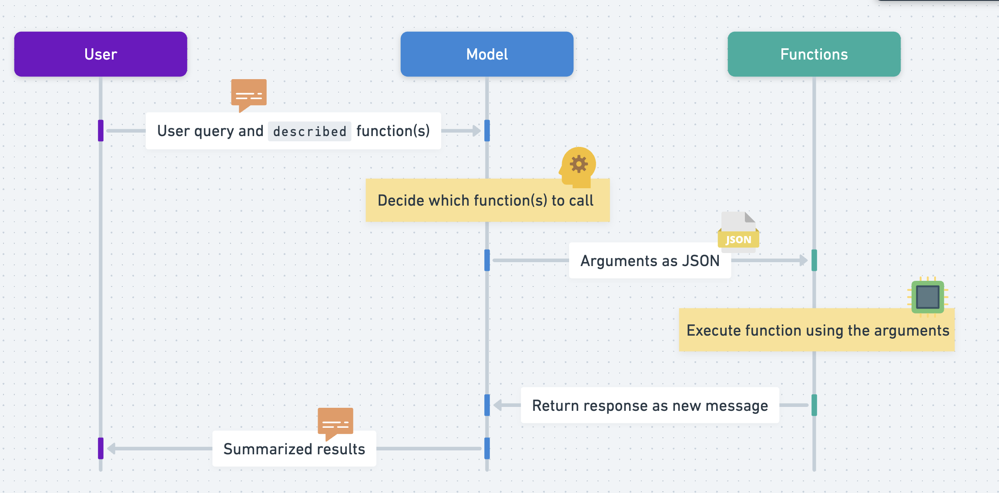

# Openai Function calling

## How it works

1. In an API call, `Describe` a function or multiple functions in the JSON format and have the model intelligently choose to output a JSON
2. The output JSON contains arguments that can be used to call one or more functions (the `described` ones)
3. ‼️Important: The Chat Completions API does not call the function; instead, the model generates JSON that `you can` use to call the function in your code.

## Potential Risks

The latest versions, `gpt-3.5-turbo-0125` and `gpt-4-turbo-preview`, can better recognize when to call a function and reply with more accurate JSON responses (to call the function) than before. However, this improvement comes with risks. We recommend adding steps to confirm with users before doing anything impactful, like sending emails or buying something.

## Documentation

[openai doc](https://platform.openai.com/docs/guides/function-calling?lang=node.js)

[step by step guide](https://cookbook.openai.com/examples/how_to_call_functions_with_chat_models)

## Simple Explanation

Basically, function calling `allows you to more reliably get structured data (JSON) back from the model`, so you can use it to call a function in your code.

## Sequence diagram

### The basic sequence of steps for function calling is as follows:

referred from the doc:

1. Call the model with the user query and a set of functions defined in the functions parameter.
1. The model can choose to call one or more functions; if so, the content will be a stringified JSON object adhering to your custom schema (note: the model may hallucinate parameters).
1. Parse the string into JSON in your code, and call your function with the provided arguments if they exist.
1. Call the model again by appending the function response as a new message, and let the model summarize the results back to the user.

## Why we need it?

- A fast and reliable way to extract structured data from text. In the traditional way, for each scenario (question), we need to have a specific function that extracts the data from user input. The can be time-consuming when you scale up. So normally, we require the user to fill in a form. This limits the user experience.

- If we don't use the traditional way but use prompt engineering to get the structured data from the model (ask the model to extract data from plain text). Models are non-deterministic and people may phase the same question in very different ways, and even setting the temperature to 0, you may still get a output not only consists of JSON but also some text as well. To clean, extract and parse the arguments through another function is necessary and prone to errors. Using Regex or other ways to do the string manipulation is messy.

- Even we can set the response format to JSON mode, we sometimes still need to pre-process the data to get what we want.

## Code Example

## Parallel function calling

- model's ability to perform multiple function calls together, allowing the effects and results of these function calls to be resolved in parallel.

- useful if functions take a long time, and reduces round trips with the API.

For example, the model may call functions to get the weather in `3` different locations at the same time, which will result in a message with 3 function calls in the `tool_calls` array, each with an `id`.

To respond to these function calls, add 3 new messages to the conversation, each containing the result of one function call, with a `tool_call_id` referencing the id from `tool_calls`.

## Code Example

### Description

In this example, we define a single function `get_current_weather`. The model calls the function multiple times, and after sending the `function response` back to the model, we let it decide the next step. It responded with a user-facing message which was telling the user the temperature in San Francisco, Tokyo, and Paris. Depending on the query, it may choose to call a function again.

If you want to force the model to call a specific function you can do so by setting `tool_choice` with a specific function name. You can also force the model to generate a user-facing message by setting `tool_choice: "none"`. Note that the default behavior `(tool_choice: "auto")` is for the model to decide on its own whether to call a function and if so which function to call.

`functions` property of `ChatCompletionCreateParamsBase` is deprecated and use `tools` instead.

`function_call` is deprecated and use `tool_choice` instead.

`tool_choice`: Controls which (if any) function is called by the model. none means the model will not call a function and instead generates a message. auto means the model can pick between generating a message or calling a function. Specifying a particular function via {"type": "function", "function": {"name": "my_function"}} forces the model to call that function.

none is the default when no functions are present. auto is the default if functions are present.
